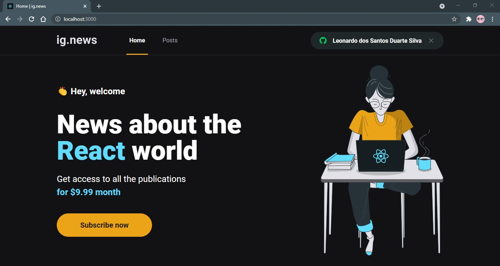

# ig.news




## Introdução

> Esse projeto foi desenvolvido durante o capítulo 2 do curso Ignite, da Rocketseat, na trilha de React.js

ig.news é uma plataforma de leitura de notícias para pessoas que se interessam pelo mundo React. Através do pagamento de uma assinatura mensal é possível acessar todos posts já publicados, caso não haja pagamento, apenas uma introdução será mostrada

## Tecnologias

- [Next.js](https://nextjs.org/) (SSG, SSR, React, ...)
- [Prismic](https://prismic.io/) (CMS para o blog)
- [Stripe](https://stripe.com/br) (para pagamentos)
- [Fauna](https://fauna.com/) (para persistência de dados)

## 🚀 Instalando o projeto

Para instalar o projeto, siga estas etapas:

```bash
# Clone o projeto
$ git clone https://github.com/LeoUpperThrower4/ignews.git

# Acesse-o
$ cd ignews

# Instale suas dependências
$ yarn

# Você terá que criar um arquivo na raiz do projeto chamado .env e nele precisará preencher as variáveis do Stripe, Prismic, Github, etc...

# Construa a aplicação final
$ yarn build

# Inicie-a
$ yarn start

```

## 📫 Contribuindo para o projeto

Para contribuir com o projeto, siga estas etapas:

1. Bifurque este repositório.
2. Crie um branch: `git checkout -b <nome_branch> origin/main`.
3. Faça suas alterações e confirme-as: `git commit -m '<mensagem_commit>'`
4. Envie para o branch original: `git push origin <nome_branch>`
5. Crie a solicitação de pull para a branch main.

Como alternativa, consulte a documentação do GitHub em [como criar uma solicitação pull](https://help.github.com/en/github/collaborating-with-issues-and-pull-requests/creating-a-pull-request).

## 😄 Contribua<br>

Sinta-se à vontade para contribuir!

## 📝 Licença

Esse projeto está sob a licença MIT.
